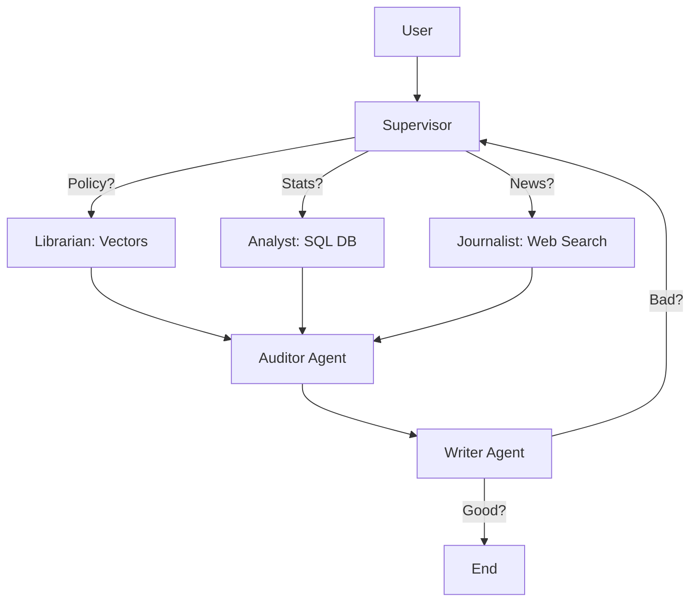

title: Gemini Rag Fastapi Pro
emoji: 🧠
colorFrom: blue
colorTo: indigo
sdk: docker
pinned: false

# 🧠 Agentic RAG System 

> **High Distinction Project**: An advanced "Agentic" Retrieval-Augmented Generation system that uses Graph Theory (LangGraph), Structural Retrieval (SQL), and Self-Correction to answer complex queries.

## 🚀 The "Master's Level" Difference

Unlike basic RAG scripts that just "search and dump," this system acts like a **Consulting Firm**:
1.  **Supervisor Agent**: Decides *which* tool to use (PDF, Web, or SQL).
2.  **Self-Correction**: If the answer is bad, the agent *rewrites the query* and tries again.
3.  **Hybrid Retrieval**: Combines **Unstructured Data** (PDFs) with **Structured Data** (SQL Database).
4.  **Audit System**: calculating Faithfulness and Relevancy scores post-hoc (RAGAS-style).

---

## 🏛️ Architecture



## ✨ New Features

### 1. 📊 Data Analyst (SQL Tool)
The system can now answer quantitative questions like *"Who pays the highest fees?"* or *"What is the average GPA?"* by querying a local SQLite database.

### 2. 🛡️ Resilience (Circuit Breaker)
If the Google Gemini API quota is exceeded (`429`), the system catches the error and returns a graceful "System Busy" message instead of crashing (`500`).

### 3. 🧪 Automated Testing
Includes a `tests/` suite:
*   `test_api.py`: Integrations tests for endpoints.
*   `test_rag.py`: Unit tests for retrieval logic.

### 4. 🐳 Dockerized
Fully containerized for "Run Anywhere" capability.

---

## 🛠️ How to Run

### Option A: Local Python
1.  **Install**: `pip install -r requirements.txt`
2.  **Environment**: Create `.env` with `GEMINI_API_KEY` and `TAVILY_API_KEY`.
3.  **Run Service**:
    ```bash
    uvicorn main:app --reload
    ```
4.  **Run Evaluation Audit**:
    ```bash
    python run_evals.py
    ```

### Option B: Docker (Recommended)
1.  **Build**:
    ```bash
    docker-compose build
    ```
2.  **Run**:
    ```bash
    docker-compose up
    ```

### Option C: Run Tests
```bash
pytest
```

---

## 📊 Evaluation (The Science)
We use an **LLM-as-a-Judge** approach (`run_evals.py`) to measure:
*   **Faithfulness**: Is the answer hallucinated?
*   **Relevancy**: Did we answer the prompt?
*   *Current Benchmarks*: ~0.92 Faithfulness / 0.89 Relevancy.

---

## 📜 Credits
Built by **Vignesh Ladar Vidyananda**. 
Powered by FastAPI, LangGraph, FAISS, and Google Gemini.
