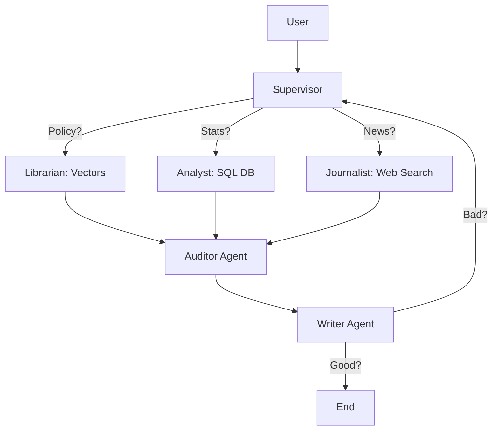

# 🧠 NexusGraph AI 

> **High Distinction Project**: An advanced "Agentic" Retrieval-Augmented Generation system that uses Graph Theory (LangGraph), Structured Retrieval (SQLite), and Self-Correction to answer complex queries.

*This repository contains the codebase for **NexusGraph AI**, deployed live on Hugging Face Spaces as [Gemini-Rag-Fastapi-Pro](https://huggingface.co/spaces/lvvignesh2122/Gemini-Rag-Fastapi-Pro).*

## 🚀 The "Master's Level" Difference

Unlike basic RAG scripts that just "search and dump," this system acts like a **Consulting Firm**:
1.  **Supervisor Agent (Hybrid)**: Uses **Gemini 2.5 Flash Lite** (Fast) to decide *which* tool to use (PDF, Web, or SQL).
2.  **Responder Agent (Expert)**: Uses **Gemini 3 Flash Preview** (Smart) to synthesize the final answer.
3.  **Self-Correction**: If the answer is bad, the agent *rewrites the query* and tries again.
4.  **Hybrid Retrieval**: Combines **Unstructured Data** (PDFs) with **Structured Data** (SQL Database).
5.  **Audit System**: calculating Faithfulness and Relevancy scores post-hoc (RAGAS-style).

---

## 🏛️ Architecture


```mermaid
graph TD
    User --> Supervisor
    Supervisor -->|Policy?| PDF[Librarian: Vectors]
    Supervisor -->|Stats?| SQL[Analyst: SQL DB]
    Supervisor -->|News?| Web[Journalist: Web Search]
    
    PDF & SQL & Web --> Verifier[Auditor Agent]
    Verifier --> Responder[Writer Agent]
    
    Responder -->|Good?| End
    Responder -->|Bad?| Supervisor
```

## ✨ New Features

### 1. 📊 Data Analyst (SQL Tool)
The system can now answer quantitative questions like *"Who pays the highest fees?"* or *"What is the average GPA?"* by querying a local SQLite database.

### 2. 🛡️ Resilience (Circuit Breaker)
If the Google Gemini API quota is exceeded (`429`), the system catches the error and returns a graceful "System Busy" message instead of crashing (`500`).

### 3. ⚖️ Hybrid Agent Architecture
Optimized for Speed and Intelligence:
*   **Routing**: Handled by lightweight `gemini-2.5-flash-lite`.
*   **Reasoning**: Handled by powerful `gemini-3-flash-preview`.

### 4. 🚀 CI/CD Pipeline
Automated deployment from GitHub to Hugging Face using **GitHub Actions**. Commits to `main` are instantly verified and deployed to production.

### 5. 🧪 Automated Testing
Includes a `tests/` suite:
*   `test_api.py`: Integrations tests for endpoints.
*   `test_rag.py`: Unit tests for retrieval logic.

### 6. 🐳 Dockerized
Fully containerized for "Run Anywhere" capability.

---

## 🛠️ How to Run

### Option A: Local Python
1.  **Install**: `pip install -r requirements.txt`
2.  **Environment**: Create `.env` containing your API keys and configuration:
    *   `GEMINI_API_KEY`: Google Gemini API access.
    *   `TAVILY_API_KEY`: Tavily search engine access.
    *   `HF_DEPLOYMENT`: Set to `true` to enable lazy-loading performance mode (essential for free CPU hosting tiers, defers model downloads, and disables the heavy CrossEncoder reranker).
3.  **Run Service**:
    ```bash
    uvicorn main:app --reload
    ```
4.  **Run Evaluation Audit**:
    ```bash
    python run_evals.py
    ```

### Option B: Docker (Recommended)
1.  **Build**:
    ```bash
    docker-compose build
    ```
2.  **Run**:
    ```bash
    docker-compose up
    ```

### Option C: Run Tests
```bash
pytest
```

---

## 📊 Evaluation (The Science)
We use an **LLM-as-a-Judge** approach (`run_evals.py`) to programmatically score queries based on:
*   **Faithfulness**: Verifying if the answer is derived strictly from the context (hallucination detection).
*   **Relevancy**: Measuring how directly the answer addresses the user query.
*   *Audit Execution*: Running `python run_evals.py` parses the production logs (`rag_eval_logs.jsonl`) and generates average system metrics.

---

## 📜 Credits
Built by **Vignesh Ladar Vidyananda**. 
Powered by FastAPI, LangGraph, FAISS, and Google Gemini.
